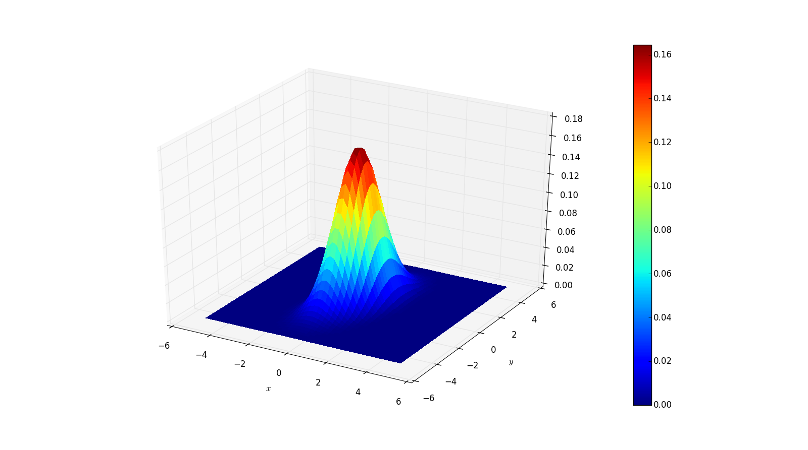

Python implementation that computes and plots a bivariate normal in three dimensions.  Visualized as such:

Internal function allows for computation of multivariate distributions in greater dimensions than the bivariate case though visualization would require some retooling and ingenuity.
